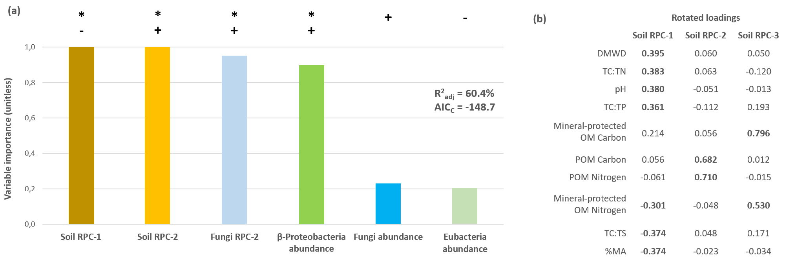

# My Data Science Portfolio

Quelques exemples de mon travail d'**analyse de données**.

---

Table des matières

- [My Data Science Portfolio](#my-data-science-portfolio)
  - [Mon *Elevator Pitch*](#mon-elevator-pitch)
  - [Mes compétences en science des données](#mes-compétences-en-science-des-données)
  - [Mes projets actuels](#mes-projets-actuels)
    - [Pipeline d'intégration, de nettoyage et de validation de données](#pipeline-dintégration-de-nettoyage-et-de-validation-de-données)
    - [Tableau de bord](#tableau-de-bord)
  - [Mes projets passés](#mes-projets-passés)
    - [Modélisation d'une base de données](#modélisation-dune-base-de-données)
      - [Modèle conceptuel des données (MCD)](#modèle-conceptuel-des-données-mcd)
      - [Modèle physique des données (MPD)](#modèle-physique-des-données-mpd)
    - [Modélisation des émissions des gaz à effet de serre](#modélisation-des-émissions-des-gaz-à-effet-de-serre)
    - [Élaboration d'un indicateur clé de performance (KPI)](#élaboration-dun-indicateur-clé-de-performance-kpi)
    - [Modélisation géographique](#modélisation-géographique)
    - [Coopération internationale](#coopération-internationale)
  - [Mes *Scripts/Gists*](#mes-scriptsgists)
    - [Créer un environnement virtuel avec Python](#créer-un-environnement-virtuel-avec-python)
    - [Créer un environnement virtuel avec Conda](#créer-un-environnement-virtuel-avec-conda)
    - [Créer un dépôt de projet avec GitHub](#créer-un-dépôt-de-projet-avec-github)
    - [Déployer une application web avec Heroku](#déployer-une-application-web-avec-heroku)
    - [Pipeline d'un projet de *Data Science*](#pipeline-dun-projet-de-data-science)
  - [Autres réalisations professionnelles](#autres-réalisations-professionnelles)
    - [Maître de thèse](#maître-de-thèse)
    - [Revue littéraire](#revue-littéraire)
    - [Optimisation de procédés quantitatifs](#optimisation-de-procédés-quantitatifs)
    - [Exploration de l’Écosse](#exploration-de-lécosse)
    - [Écrire une thèse doctorale](#écrire-une-thèse-doctorale)
    - [Mes publications scientifiques](#mes-publications-scientifiques)

---

---

## Mon *Elevator Pitch*

Doué d'une grande appétence pour les **statistiques**, l'analyse exploratoire de données et l'**apprentissage automatique** (« ***machine learning*** »),  le cycle de vie entier de la *data* me passionne, depuis la modélisation d'une base de données à son utilisation dans le domaine de l'**informatique décisionnelle** (« ***Business Intelligence*** ») en passant par la création de supports visuels simples et impactant comme les **tableaux de bord** (« ***Dashboards*** »).

Je consulte fréquemment les sites spécialisés pour découvrir de nouvelles technologies pour les appliquer plus tard dans mes projets de « ***Data Science*** ».

Je crois en l’apprentissage par la pratique et, dans un futur proche, je souhaite accéder à un poste de Data Scientist spécialisé en [**Recherche Opérationnelle**](https://fr.wikipedia.org/wiki/Recherche_op%C3%A9rationnelle "Recherche Opérationnelle - Wikipedia.org") et [***DataOps***](https://medium.com/data-ops/dataops-in-7-steps-f72ff2b37812 "DataOps - Medium.com").

Pensez-vous que nous avons des objectifs communs ?

Jetez un coup d'œil à ma biographie [ici](https://github.com/loic-nazaries/loic-nazaries.github.io/blob/main/ma_biographie.md "Ma biographie").

---

---

## Mes compétences en science des données

La [**Figure 0**](#figure-0) est le « **Plan de Métro** » de mes compétences en *Data Science* appliqué au métier de **Data Analyst/Data Scientist**.

Les « **lignes** » en circulation sont:

- *Data Preparation*
- *Data Mining - Descriptive & Exploratory Data Analysis*
- *Forecasting*
- *Analysis of Variance*
- *Database Management System - Business Intelligence*
- *Machine Learning*
- *Data Visualisation - Dashboarding*

More to come!

**Figure 0**: Metro Map of my **Data Analyst/Data Scientist** skills in the field of **Data Science**.

---

---

## Mes projets actuels

---

### Pipeline d'intégration, de nettoyage et de validation de données

Une **base de données relationnelle** de type  « **flocon de neige** » a été modélisée à partir de fichiers de type et d'origine multiples (enregistreurs automatiques, mesures manuelles, fichiers au formats variés - .csv, .txt, tableur, *etc.*). Grâce aux fonctionnalités Python, ces données ont été uniformisées et "nettoyées" tout en respectant les bonnes pratiques statistiques (par exemple, pas de "*cherry-picking*", ni de "*data dredging*", *etc.* - *cf.*
[*Data Fallacies to avoid*](/documents/data-fallacies-to-avoid.pdf "Data Fallacies to avoid")).

En particulier, les trois étapes suivantes sont importantes dans tout projet de « ***Data Science*** » :

1. **Typage des variables** (*category*, *integers*/*floats*, *strings*, *booleans*, *dates*). Très important, en particulier, pour diminuer l'utilisation de la mémoire vive d'un ordinateur ou serveur

2. **Remplacement** (ou ***imputation***) des **valeurs manquantes** ([**Figure 1**](#figure-1)). C'est une étape importante qui permet de préserver la puissance statistique d'un jeux de données

    | Before Imputation                                                                                                          | After Imputation                                                                                                            |
    | -------------------------------------------------------------------------------------------------------------------------- | --------------------------------------------------------------------------------------------------------------------------- |
    |  |  |

    **Figure 1**:  The replacement (or **imputation**) of missing values by mathematical approach. Here, when the value of a replicated measurement (usually seven (7) replicates) was missing (*left panel*), it was replaced by the **"mean" value** of the other replicated samples. The remaining missing values (*right panel*) represent non-replicated data which can be imputed using more powerfull machine learning approaches (not detailed here).

3. Transformation des variables pour obtenir une distribution dite « **normale** » ([**Figure 2**](#figure-2)). Le but est donc de diminuer le nombre de **valeurs « extrêmes »**, c'est-à-dire des valeurs *très* éloignées de la valeur moyenne.

    

    **Figure 2**: Mathematical transformation of nitrous oxide (N2O) emissions. The various « violin plots » represent different transformation of the raw data in order to seek « **normal distribution** » *(e.g.* standardised transformation, square-root transformation, *etc.*). The aim is to reach a **symetrical distribution** and thus avoid (left- or right-handed) tails.

De manière plus générale, il s'agit de préparer les jeux de données pour les étapes d'analyses statistiques et de modélisation (« *machine learning* »)

---

### Tableau de bord

Un tableau de bord (« *dashboard* ») interactif a été construit pour observer et tester les émissions des gaz à effet de serre sous différentes conditions. Cette **application web** appelée « ***Greenhouse Gas Estimation Portal*** » a été codé avec la librairie Python [Streamlit](https://www.streamlit.io/ "Streamlit.io") et déployée sur [Heroku.com](https://www.heroku.com/ "Heroku.com"). L'application peut être accédée par le [lien suivant](https://exam-piscine-heroku-redone.herokuapp.com/ "Greenhouse Gas Estimation Portal App").

Il s'agit d'une application entièrement réglable une fois que l'utilisateur a créé un compte. Voici une liste (non-exhaustive) des options disponibles:

- téléchargement du fichier de données (format .csv ou .pkl)
- sélection des variables à inclure dans l'analyse
- typage des variables
- choix des variables dépendantes et indépendantes
- « *dummification* » possible des variables
- génération d'un résumé statistique (moyenne, écart-type, kurtosis/skewness, pourcentage des valeurs manquantes, *etc.*)
- agrégation des données par groupe (date, traitement, année, *etc.*)
- analyses univariées et bivariées
- analyses de corrélation
- analyses statistiques de type « REML » (*restriction likelihood*)
- envoie des résultats à l'utilisateur par *email*

Des captures d'écran sont disponibles dans la ([**Figure 3**](#figure-3)).
Elles reflètent certaines des options disponibles à l'utilisateur.

| Login to GHG Estimation Portal                                                                                     | Variable Selection                                                                                                |
| ------------------------------------------------------------------------------------------------------------------ | ----------------------------------------------------------------------------------------------------------------- |
|                                      |  |
| Time-Series Analysis                                                                                               | Email Option                                                                                                      |
|  |                       |

**Figure 3**: Screenshots of various steps and options available to the user on the web application « Greenhouse Gas Estimation Portal ».

Note: Dans l'avenir, une section de *machine learning* sera disponible. Il sera en autre possible de procéder à une modélisation temporelle des émissions des gaz à effet de serre.

**EDIT**: application non disponible au moment de la préparation de cette page (10/01/2021).

---

---

## Mes projets passés

---

### Modélisation d'une base de données

Un **système de gestion de base de données relationnelle** (SGBDR) a été construit pour le projet « ***EucFACE*** ». La base de données a été implémentée avec le logiciel **[PostgreSQL](https://www.postgresql.org/ "PostgreSQL")** (version 12.5) et **pgAdmin4**.

Note: le projet *EucFACE* est présenté brièvement [ici](#modélisation-des-émissions-des-gaz-à-effet-de-serre "EucFACE project").

Cliquer [ici](/documents/RDBMS_UML.html "RDBMS UML - EucFACE") pour ouvrir la structure UML de l'application ***Greenhouse Gas Estimation Portal*** (voir la section précédente "[Tableau de bord](#tableau-de-bord "Tableau de bord")"). Y sont contenus les diagrammes de contexte, de fonctionnalités, de cas d'utilisation et d'activité de la base de données EucFACE.

Les [**Figure 4**](#figure-4) et [**Figure 5**](#figure-5) montrent, respectivement, le **modèle conceptuel des données** (**MCD**) et le **modèle physique des données** (**MPD**) de la base de données relationnelle EucFACE. Sa structure est de type  « **flocon de neige** ».

#### Modèle conceptuel des données (MCD)

**Figure 4**: Modèle conceptuel des données (**MCD**) de la base de données relationnelle du projet "[EucFACE](#modélisation-des-émissions-des-gaz-à-effet-de-serre "Modelling Greenhouse Gas Emissions")".

#### Modèle physique des données (MPD)

**Figure 5**: Diagramme du système de gestion de base de données relationnelle (**SGBDR**) du projet "[EucFACE](#modélisation-des-émissions-des-gaz-à-effet-de-serre "Modelling Greenhouse Gas Emissions")".

---

### Modélisation des émissions des gaz à effet de serre

Analyse des émissions de **gaz à effet de serre** dans des conditions de concentrations atmosphériques en CO2 élevées. En résumé, cela mimique les conditions de **changement climatique** prévues pour l'année 2100.

Voir la section [EucFACE Site Presentation](https://github.com/loic-nazaries/loic-nazaries.github.io/blob/main/eucface_site_presentation.md "EucFACE Site Presentation") pour une description détaillée du projet, incluant l'hypothèse scientifique testée, matériel et méthodes et les références bibliographiques principales.

**Vidéo 1**: Moving up a ring at the EucFACE site.

**Photo 1**: Canopy view from Ring 1 at the EucFACE Site.

Une analyse temporelle (*time-series analysis*) a été appliquée ([**Figure 6**](#figure-6)) pour tester l'**hypothèse scientifique** de départ:

> « Quel est l'effet de l'augmentation du dioxide de carbone (CO2) dans l'atmosphère sur les émissions des gaz à effet de serre? »

**Figure 6**: Greenhouse gas (GHG) emissions for méthane (CH4 flux - panel a), nitrous oxide (N2O flux - panel b) and carbon dioxide (CO2 flux - panel c). Ambient (blue line) and elevated (red line) atmospherique CO2 concentrations represent the « treatment » applied to test the scientific hypothesis investigated.

There is a strong visible link between the intensity of GHG emissions and the intensity of the rainfall events (panel d).

Ces travaux ont été publiés par [Martins, Nazaries *et al.*, 2021](https://github.com/loic-nazaries/loic-nazaries.github.io/blob/main/scientific_publications.md "[Martins, Nazaries et al., 2021 - Functional Ecology - In Review").

---

### Élaboration d'un indicateur clé de performance (KPI)

Un conglomérat d’agriculteurs australiens a financé une étude dans laquelle j’ai été chargé d’identifier les facteurs biologiques et environnementaux qui sont susceptible d’améliorer les rendements de blé en lien avec les pratiques d’agricultures communes en Australie (chaume brûlé, fertilisation, pâturage, labourage, *etc.*). Cette expérience était constituée de sites dans plusieurs régions/états de l’Australie. Un ample effort de coordination a été primordial au bon déroulement de cette étude, ainsi qu’une bonne communication avec les propriétaires des terres et les gouvernements locaux. J’ai aussi eu la charge de tenir notre base de données à jour et disponible auprès de mes collaborateurs.

Au terme de mes analyses, j’ai défini un **indicateur clé de performance** (« **KPI** » en anglais) qui révèle comment chaque pratique agricole impacte le recyclage des nutriments dans le sol, en d’autres termes, la qualité et la quantité des récoltes de blé. Durant ce projet, j’ai appris à ajuster mon discours de manière à le rendre plus compréhensible (travail de vulgarisation) auprès de non-spécialistes, c’est-à-dire les agriculteurs et les acteurs locaux. Voir la publication [Nazaries *et al.*, 2021](https://github.com/loic-nazaries/loic-nazaries.github.io/blob/main/scientific_publications.md "Nazaries et al., 2021 - Agriculture, Ecosystems and Environment - In Print").
> The response of soil multi-functionality to agricultural management practices can be predicted by key soil abiotic and biotic properties. *Agriculture, Ecosystems & Environment* 307, 107206. doi:<https://doi.org/10.1016/j.agee.2020.107206>.

**Figure 7**: The effect of agricultural practices on the **KPI** (or Multifunctionality (MF) Index) at three locations (sites a, b and c - top panel). The bottom panel shows the **modelling** of the KPI and indicates which variables had the highest influence on the KPI. The modelling approach was **Information theory and multi-model inference** (MMI) and used the **Akaike’s Information Criterion** (corrected for sample size, or **AICC**) to compare the model strengths with each other.

---

### Modélisation géographique

J’ai complété une étude décrivant les étapes de modélisation nécessaire pour **prédire la répartition géographique** de microbes dans le sol responsables de la réduction des concentrations de méthane (un puissant gaz effet de serre) dans l’atmosphère.
Grâce au sponsor du gouvernement écossais, une grande base de données a été construite après un sondage du sol dans toute l’Écosse. L’objectif a été de collecter plusieurs données environnementales (température, pluies, humidité, nutriments, fertilité, composition minérale, *etc.*) pour mieux décrire les procédés biologiques dans le sol. J’ai réparti les tâches de modélisation entre mes collaborateurs pour faire avancer le processus intellectuel. Une fois les analyses terminées, j’ai écrit un article scientifique pour présenter nos résultats. Cela a été une occasion fantastique pour apprendre à manier des **méthodes statistiques** pointues. Voir la publication [Nazaries *et al.*, 2018](/documents/scientific_publications/Nazaries_et_al_2018.pdf "Nazaries et al., 2018 - Soil Biology and Biochemistry").
> Environmental drivers of the geographical distribution of methanotrophs: Insights from a national survey. *Soil Biology and Biochemistry*. doi:<https://doi.org/10.1016/J.SOILBIO.2018.08.014>.

| Geographical Modelling                                               | Microbial Community Clusters                                        |
| -------------------------------------------------------------------- | ------------------------------------------------------------------- |
|  |  |

**Figure 8**: **Geographical modelling** of microbes involved in the uptake of atmospheric methane and its storage in soil (left panel). The right panel shows how microbes **cluster** with each other within different ecosystems.

J’ai rendu publique (***open source***) ma base de données sur le site [figshare.com](https://figshare.com "figshare.com") pour permettre à d’autres équipes d’utiliser mes données pour leurs propres études.

---

### Coopération internationale

Après avoir établi une collaboration avec des chercheurs d’Australie, Angleterre, Écosse et États-Unis, j’ai mis en place une série de **protocoles** afin d’organiser les tâches administratives et techniques nécessaire pour remplir l’objectif de la mission (mesure des gaz à effet de serre). J’ai aussi eu à charge la **formation** des collaborateurs et la **coordination** des équipes pour garantir les délivrables.
Une fois les données générées, je les ai soumis à une **analyse descriptive** complète qui inclue: **agrégation et préparation ; enregistrement dans une base de données ; nettoyage ; détection de données aberrantes et de données manquantes ; transformation/normalisation ; exploration**. Enfin, j’ai conduit toutes les analyses statistiques, j’ai préparé les résultats (tables et graphes) et j’ai décrit les conclusions dans un **rapport de mission**. Particulièrement, j’ai présenté les conclusions de cette étude devant les « clients », c’est-à-dire les organismes privés et publiques qui ont financés ma recherche. **Grâce à cette expérience, j’ai réussi à gérer des projets de bout-en-bout ainsi qu’à faire face à des ***challenges*** administratifs, techniques et humains**. Un des articles issus de cette collaboration est [Martins, Nazaries *et al.*, 2017](/documents/scientific_publications/Martins_et_al_2017.pdf "Martins, Nazaries et al. 2017 - Functional Ecology").
> Identifying environmental drivers of greenhouse gas emissions under warming and reduced rainfall in boreal-temperate forests. *Functional Ecology* 31, 2356–2368. doi:<https://doi.org/10.1111/1365-2435.12928>.

---

---

## Mes *Scripts/Gists*

---

### Créer un environnement virtuel avec Python

Dans tout **projet data**, il est important de pouvoir créer un **environnement technique** reproductible par une autre personne ou sur un autre ordinateur. Ceci signifie que le langage de programmation (Python, par exemple) et la version des librairies utilisées lors de l'écriture d'un script doivent être établis dès le début du projet.

Pour cette raison, il est courant de créer un **environnement virtuel** qui va contenir toutes ces données ainsi que la structure des dossiers contenant les fichiers essentiels au projet.

Voici donc un **script**, ou ***gist***, qui détaille les différents étapes de la création d'un **environnement virtuel** avec le module "**venv**" de **Python**.

Le *gist* est disponible [ici](/documents/scripts_gists/create_a_virtual_environment_with_python.html "Create a Virtual Environment with Python - HTML Version") ainsi que sur [GitHub Gist](https://gist.github.com/loic-nazaries "Create a Virtual Environment with Python - Markdown Version").

---

### Créer un environnement virtuel avec Conda

Ici, la gestion des **librairies Python** nécessaires au **projet data** sont gérées grâce à [**Conda**](https://docs.conda.io "Conda documentation"). Il s'agit du même principe de création d'un **environment virtuel**.

La différence avec un le module "venv" de Python est que la version de Python (par exemple version 2.7 *vs.* 3.9.1) est aussi installée.

Le *gist* est disponible [ici](/documents/scripts_gists/create_a_virtual_environment_with_conda.html "Create a Virtual Environment with Conda - HTML Version") ainsi que sur [GitHub Gist](https://gist.github.com/loic-nazaries "Create a Virtual Environment with Conda - Markdown Version").

---

### Créer un dépôt de projet avec GitHub

Bientôt !

---

### Déployer une application web avec Heroku

Bientôt !

---

### Pipeline d'un projet de *Data Science*

Bientôt!

---

---

## Autres réalisations professionnelles

---

### Maître de thèse

J’ai eu la responsabilité de superviser deux étudiantes. Je les ai soutenues dans la définition et la construction de leur projet de recherche : identification des lacunes scientifiques ; mise en place des protocoles ; formation technique et littéraire ; analyse des données et écriture de leur manuscrit de thèse. **Le plus gratifiant a été quand j’ai assisté à leur cérémonie de remise des diplômes**.

---

### Revue littéraire

J’ai recherché sur internet des centaines d’études et d’articles en rapport avec mon thème de recherche : les émissions biologiques du gaz méthane (CH4) qui produit un effet de serre 31 fois plus puissant que the dioxide de carbone (CO2). J’ai décrit les bactéries responsables du **cycle du CH4 entre l’atmosphère et le sol** ainsi que leurs propriétés génétiques et biochimiques. J’ai concentré mes trouvailles en une large revue publiée dans un journal scientifique (voir [Nazaries *et al.*, 2013](/documents/scientific_publications/Nazaries_et_al_2013b.pdf "Nazaries et al. 2013 - Environmental Microbiology")).
> Methane, microbes and models: fundamental understanding of the soil methane cycle for future predictions. *Journal of Environmental Microbiology*. doi:<https://doi.org/10.1111/1462-2920.12149>.

---

### Optimisation de procédés quantitatifs

Ou, Surmonter une difficulté.

J’ai été confronté à une **situation frustrante** au cours de laquelle un system de détection génétique était défectueux. J’ai opéré une recherche bibliographique au cours de laquelle j’ai trouvé un algorithme d’optimisation opérationnelle appartenant aux méthodes [***Taguchi***](https://en.wikipedia.org/wiki/Taguchi_methods "Taguchi Methods"). L'utilisation d'une ***loss function*** spécifique m’a aidé à franchir cet obstacle. Cette approche est beaucoup utilisée dans l’industrie pour améliorer la qualité des produits de confection ; mais j’ai su l’adapté à ma technologie génétique.

Les méthodes Taguchi sont applicables à tout procédés quantitatifs. Si vous cherchez à optimiser une méthode de détection génétique appelée *qPCR*, j'ai préparé une [présentation](/documents/taguchi_optimisation_qpcr.ppsx "qPCR Optimisation with the Taguchi Methods") qui pourrait vous intéresser.

---

### Exploration de l’Écosse

Mon projet d’étude nécessitait la sélection de plusieurs sites écologiques pour la mesure de flux de méthane dans l’atmosphère. J’ai dû sélectionner des sites aux quatre coins de l’Écosse afin d’avoir des conditions variées. J’avais aussi la charge de préparer toute la logistique, trouver des collaborateurs disponibles sur plusieurs jours, et ce, durant les quatre saisons de l’année, et pendant trois ans. **C’était un projet très difficile et demandant qui m’a permis d’apprendre beaucoup, autant au niveau technique et professionnel qu’au niveau personnel et humain**.

---

### Écrire une thèse doctorale

C’était une épreuve très demandant et difficile. On m’a donné un thème de recherche et j’ai dû faire tout le reste : recherche littéraire ; planification des expériences ; génération des données ; analyses statistiques ; et surtout, écriture de ma thèse de fin d’étude. J’ai retranscrit tout ce que j’avais fait pendant plus de trois ans. Finalement, j’ai publié cette thèse dont je suis très fier. **Cela m’a beaucoup appris : indépendance, autonomie, adaptabilité, organisation, rigueur**.
> Nazaries, L., 2011. Impact of land-use changes on the methanotrophic community structure. Thesis University of Warwick.

---

### Mes publications scientifiques

Cliqué [ici](https://github.com/loic-nazaries/loic-nazaries.github.io/blob/main/scientific_publications.md "Mes publications scientifiques") pour accéder à la liste des publications.
